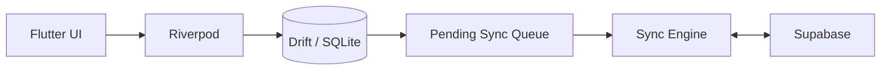

# Task Manager

A privacy-first, local-first task manager for Windows and Android.

Task Manager works fully offline without an account, while optional Supabase synchronization enables multi-device access and shared folders, tasks, and checklists. The local SQLite database remains the primary source of truth, so the app stays usable without an internet connection or cloud service.

> **Status:** Built from scratch during OpenAI Build Week using Codex with GPT-5.6. Core task management, reminders, backup, synchronization, and shared tasks are implemented. Some interfaces and data structures may still change.

## OpenAI Build Week

This project was built from scratch for **OpenAI Build Week** in the **Apps for Your Life** track.

The first functional version was created in approximately one day of intensive development with Codex powered by GPT-5.6, using roughly a weekly token allowance. Codex handled architecture, implementation, testing, debugging, and documentation.

The developer acted as product owner and reviewer: defining and adjusting requirements, approving functionality, testing the application, reporting bugs, and providing feedback for fixes.

## Why Use It

- **Offline when privacy matters** — keep tasks only on the device and use the app without an account.
- **Online when convenience matters** — synchronize tasks between Windows and Android.
- **Shared work when coordination matters** — share folders, tasks, and checklists with another registered user.
- **Local-first reliability** — tasks remain available when the network is slow, unavailable, or the sync service is temporarily unreachable.
- **Desktop and mobile support** — use the same task system on a Windows computer and an Android phone.

## Main Features

- Tasks, notes, due dates, priorities, tags, folders, subtasks, recurrence, snooze, and pinning
- Checklists and reusable checklist templates
- Calendar and smart-filter views
- Local reminders on Windows and Android
- Local database backup and restore
- Optional Supabase authentication and synchronization
- Shared folders, tasks, and checklists
- Windows tray integration and compact task view

## Screenshots


## Offline or Online

### Offline mode

Use offline mode when you want the simplest setup or do not want task data stored in the cloud.

- No account required
- No internet connection required
- Data stays in the local SQLite database
- Backup and restore are handled locally

### Online mode

Use online mode when you need synchronization or collaboration.

- Keep tasks synchronized between Windows and Android
- Work with the same folders and checklists on multiple devices
- Share selected folders, tasks, and checklists with another user
- Continue working locally when temporarily offline and synchronize later

Online mode uses a self-configured Supabase backend. Cloud synchronization is optional and can be omitted completely.

## Architecture

The application follows a local-first architecture:

1. User actions are written to the local Drift/SQLite database.
2. The Flutter interface observes local data through Riverpod providers.
3. Pending changes are stored locally when synchronization is enabled.
4. The synchronization layer sends local changes to Supabase and retrieves remote updates.
5. Supabase Realtime notifications trigger incremental synchronization.
6. Failed operations remain queued locally and are retried when connectivity returns.



The user interface reads from the local database, including while the device is offline.

## How Codex and GPT-5.6 Were Used

Development followed an iterative agent-driven workflow:

1. The developer described the required behavior and constraints.
2. Codex designed and implemented the functionality.
3. The developer reviewed and tested the result.
4. Bugs, missing behavior, and usability issues were reported as feedback.
5. Codex investigated the feedback, applied fixes, and ran development checks.
6. The cycle continued until the functionality was approved.

Codex with GPT-5.6 was used across the complete project, including:

- application architecture and Flutter project structure;
- user interface implementation;
- Drift and SQLite persistence;
- reminders, recurrence, filtering, checklists, and backups;
- Supabase authentication, synchronization, sharing, and security policies;
- Windows and Android platform integration;
- tests, static analysis, debugging, and documentation.

The human developer remained responsible for product direction, functional approval, testing, bug reports, and final scope and usability decisions.

## Supported Platforms

| Platform | Status |
| --- | --- |
| Windows 10/11 x64 | Supported |
| Android | Supported |
| Web | Planned |
| macOS, Linux, iOS | Not currently supported |

## Getting Started

### Requirements

- Flutter SDK with Dart `>=3.3.0 <4.0.0`
- Visual Studio with **Desktop development with C++** for Windows builds
- Android Studio or Android SDK for Android builds

Check the development environment:

```powershell
flutter doctor -v
```

Install dependencies and generate the database code:

```powershell
flutter pub get
dart run build_runner build --delete-conflicting-outputs
```

### Run on Windows in offline mode

```powershell
flutter run -d windows
```

Choose offline mode on the authentication screen. Supabase configuration is not required.

### Run on Android in offline mode

List connected devices:

```powershell
flutter devices
```

Run the application:

```powershell
flutter run -d <android-device-id>
```

Choose offline mode on the authentication screen.

### Enable online synchronization

Copy the environment template:

```powershell
Copy-Item supabase.env.example supabase.env
```

Add your Supabase project URL and publishable key, then apply:

- `supabase/schema.sql`
- migrations from `supabase/migrations/`

Start the Windows application with:

```powershell
.\run.bat
```

## Technology

- Flutter and Dart
- Riverpod
- Drift and SQLite
- Supabase Auth, Postgres, Realtime, and Row Level Security
- Flutter local notifications
- Secure OS credential storage
- OpenAI Codex with GPT-5.6 for architecture, implementation, testing, debugging, and documentation

## Data and Security

- SQLite is the local source of truth.
- Cloud synchronization is optional.
- Local databases, backups, environment files, signing keys, and release builds are excluded from Git.
- Cloud data access is protected with Supabase Row Level Security.
- Pending changes are stored locally and retried when synchronization becomes available.
- Test accounts and sample data must contain synthetic information only.

Before running a public Supabase instance, review all policies and migrations in `supabase/`.

## Third-Party Services and Components

- Supabase — optional authentication, database, realtime synchronization, and sharing
- Flutter packages — listed in `pubspec.yaml`
- OpenAI Codex with GPT-5.6 — software development workflow
- Screenshots and project assets — created for this project

All third-party components are used according to their respective licenses.

## Known Limitations

- No web client yet
- Attachments are not uploaded to Supabase Storage
- Search currently uses local substring matching instead of SQLite FTS
- Android and Windows application identifiers will be replaced in a future update

## License

This project is licensed under the [MIT License](LICENSE).

Copyright © 2026 Einhorn inc.
